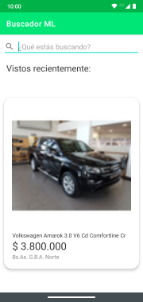
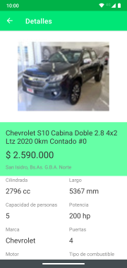

Challenge ML
=================

This application allows you to search and view products using Mercadolibre's open api.

Screenshots 
----------------

Architecture 
----------------

The app was built following the MVVM pattern.

Libraries
---------------
* Kotlin Coroutines
* LiveData
* Retrofit
* Coil
* Dagger Hilt
* Material Components
* Navigation Components
* Room
* Mockito
* Espresso

Considerations
---------------

* The app relies in Dagger Hilt which is still in alpha state.
* The app was only tested in phones, might need some work in devices with different form factor.

TODO
---------------
* Add an icon.
* String translation. (currently only available in spanish)